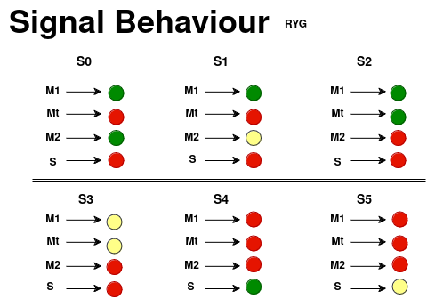

# Traffic Controller System

## Overview

This project implements a **Traffic Controller System** in SystemVerilog, using a 6-state Finite State Machine (FSM) to manage traffic lights for two main roads (M1, Mt, M2) and one side road (S). The FSM cycles through predefined states, ensuring proper traffic flow.

## Features

- **FSM with 6 states (S0-S5)** controlling the traffic lights.
- **3-bit outputs** for each road, controlling red, yellow, and green lights.
- **Clock-driven state transitions** with fixed delays for each state.

### Traffic Lights
- **Green**: `001`
- **Yellow**: `010`
- **Red**: `100`

## I/O Ports

- **clk**: Clock input.
- **rst**: Reset input.
- **light_M1**: Traffic light for Main Road 1.
- **light_Mt**: Traffic light for Transition.
- **light_M2**: Traffic light for Main Road 2.
- **light_S**: Traffic light for Side Road.

### FSM State Transitions
- **S0:** M1 & M2 green, S red.
- **S1:** M2 yellow, M1 green, S red.
- **S2:** M1 green, M2 red, S red.
- **S3:** M1 yellow, M2 red, S red.
- **S4:** M1 & M2 red, S green.
- **S5:** M1 & M2 red, S yellow.

## Usage

### Running the Simulation

To compile and simulate:

```bash
make
```

To clean up:

```bash
make clean
```

### Testbench

The testbench verifies the FSM functionality by simulating the traffic light changes over time. View the results using ModelSim's waveform viewer.


## FSM Diagram
### Design Details

### Top Level Diagram


### Main Pathway


### Lights Behaviour


### Controller


### Simulation Waveform


